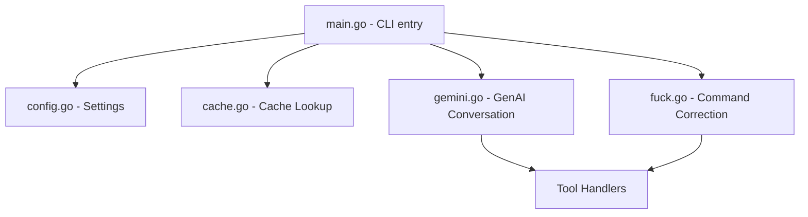

# Agent Guide - Gemhelp Architecture & Patterns

This document is compiled for subsequent LLMs and developers working on the `gemhelp` codebase. It outlines core design decisions, system layout, and runtime mechanics.

## 1. System Architecture

## 2. File Roles & Descriptions

*   **`main.go`**: Entry point. Parses flags (`--no-cache`, `--tldr`, `--man`, `--wiki`, `--fuck`) and manages subcommands (`man`, `tldr`, `wiki`, `fuck`). Detects executable base name (`os.Args[0]`) to route multi-call aliases.
*   **`fuck.go`**: Implements the `fuck` (command correction) logic. Uses a dedicated system prompt to diagnose and fix failed terminal commands. Reuses the tool-calling infrastructure from `gemini.go`.
*   **`config.go`**: Manages reading, writing, and prompt setup of `~/.config/gemhelp/config.json`. Includes API key validation via minimal SDK invocation.
*   **`cache.go`**: Hashes queries using SHA-256 and retrieves or writes response caches to `~/.cache/gemhelp/responses/`.
*   **`man.go`**: Implements custom ROFF/groff tokenization and macro matching to parse system man pages under `/usr/share/man/` (handles `.gz` files) without invoking system `man`.
*   **`tldr.go`**: Downloads translation-specific zip archives from GitHub releases and caches them locally at `~/.local/share/gemhelp/tldr/`. Resolves pages following custom-to-English and platform-to-common hierarchies.
*   **`wiki.go`**: Searches Arch Wiki, parses MediaWiki wikitext, and strips/converts wikitext templates using nested tag balancing.
*   **`gemini.go`**: Orchestrates client creation with `google.golang.org/genai`. Formulates tools schema via `buildTools()`, triggers parallel tool executions via `executeToolCallsBatch()`, and applies exponential backoffs on `ResourceExhausted` errors, falling back through the `gemini-3.5-flash` -> `gemini-3.1-flash-lite` -> `gemini-2.5-flash` chain.

## 3. Maintenance Protocols

### Bootstrapping compiler
The `build.sh` script installs Go 1.26.3 locally in the workspace if not found in `$PATH`.
Do not check in the `./go/` directory to Git.

### Shell Script Verification
If modifying `build.sh` or `package.sh`, ensure they contain only POSIX-compliant shell syntax. Any change must pass `shellcheck` and `checkbashisms` inside the `package.sh` step before it can be archived.
